# Анализ данных
---

## 1. Анализ распределения аудио-признаков

### 1.1. MFCC (Mel-frequency cepstral coefficients)

#### Сырые MFCC
Распределение сильно смещено вправо с пиком у нуля. Это указывает на большое количество "тихих" или низкоэнергетических фрагментов.

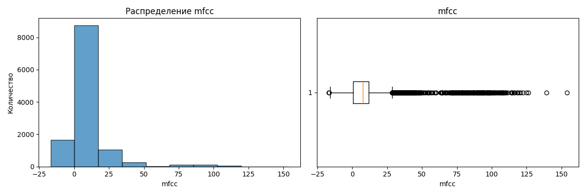

#### Среднее значение и стандартное отклонение MFCC (`mfcc`)
Распределение близко к нормальному (пик ~9.5). Хороший, устойчивый признак для модели.
Распределение скошено влево (пик ~16). Отражает динамичность спектра трека.

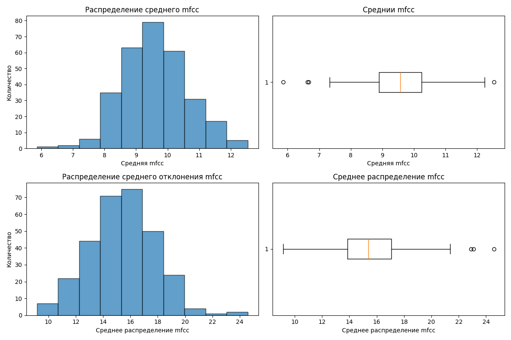

---

### 1.2. Chroma (Тональные признаки)

#### Сырые Chroma
Ещё более смещённое распределение, чем у MFCC. Много нулевых значений.

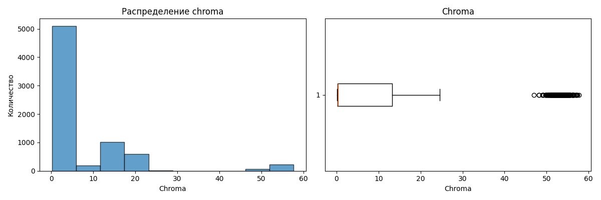

#### Среднее значение Chroma (`chroma_mean`)
Почти нормальное распределение (пик ~6.4). Отличный признак для модели.

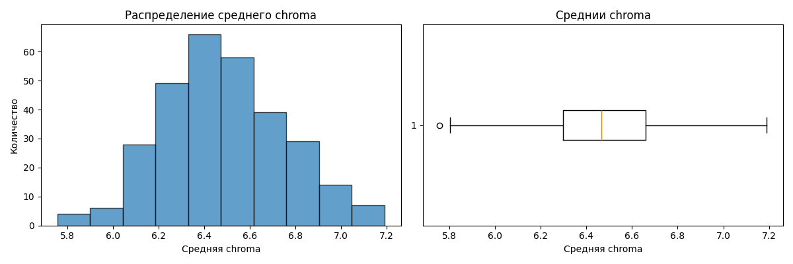

---

## 2. Анализ корреляции признаков с целевыми переменными

Проанализирована корреляция между аудио-признаками (эмбеддинги `emb_X`, их средние `_mean` и стандартные отклонения `_std`) и пятью аспектами оценки песен.

### Ключевые наблюдения:

| Целевая переменная | Наиболее коррелирующий признак | Коэффициент корреляции |
|--------------------|-------------------------------|------------------------|
| **Личность**       | `emb_188`                     | ~0.26                  |
| **Реализация**     | `emb_188`                     | ~0.26                  |
| **Рифмы**          | `st_2_std`                    | ~0.22                  |
| **Структура**      | `mb_228`                      | ~0.22                  |
| **Атмосфера**      | `emb_42`                      | ~0.19                  |

#### Корреляция с `atmosphere`
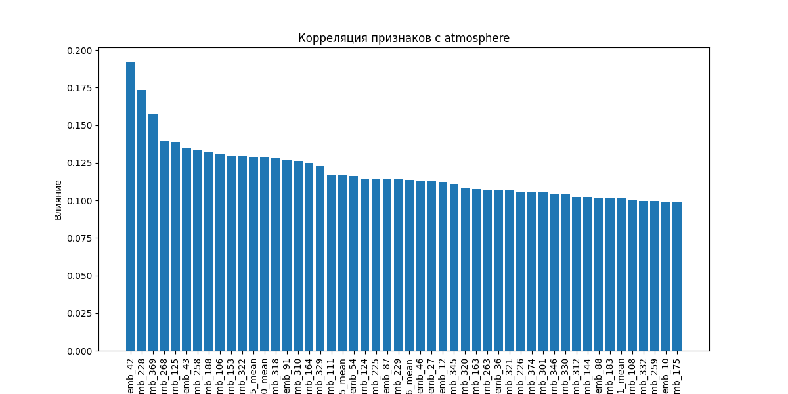

#### Корреляция с `personality`
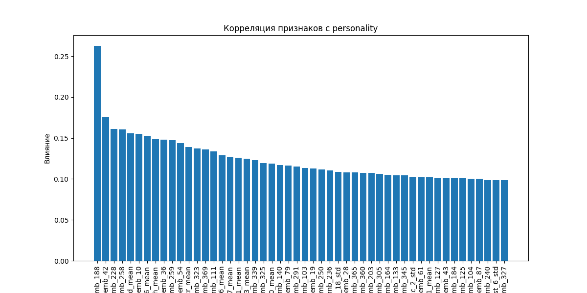

#### Корреляция с `realization`
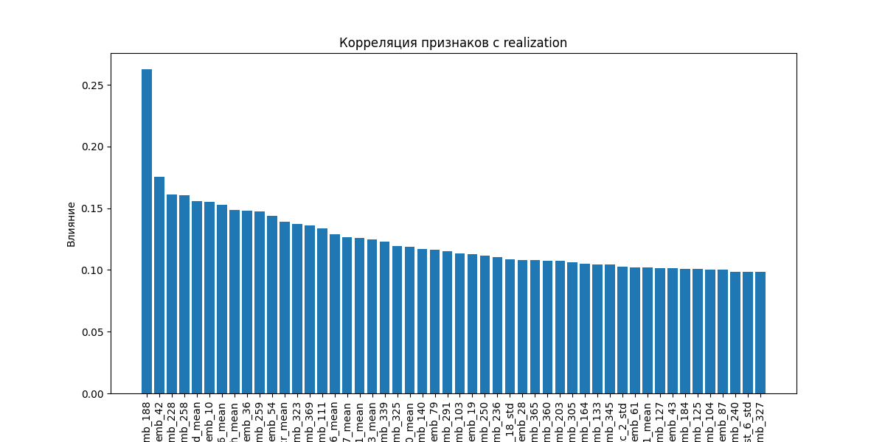

#### Корреляция с `rhymes`
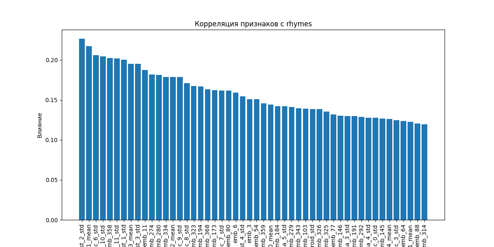

#### Корреляция с `structure`
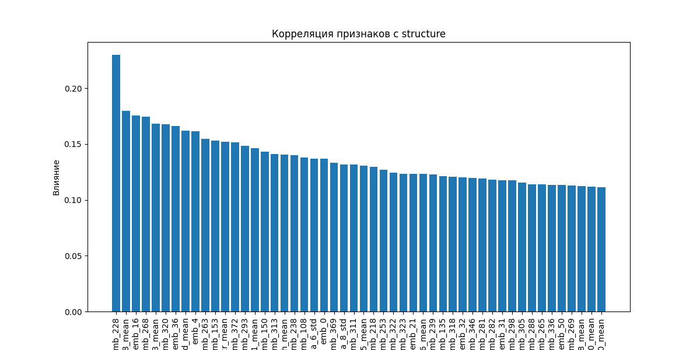

---

## 3. Анализ распределения и надёжности оценок

### 3.1. Сырые оценки (0–10)

Распределение сильно смещено вправо. Пик на оценках 9 и 10.

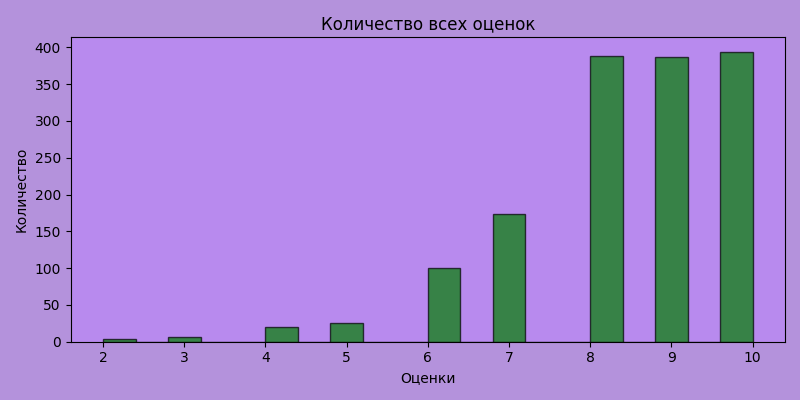

### 3.2. Итоговые (агрегированные) оценки

Распределение близко к нормальному (пик ~80). Наличие выбросов в нижней части (<50).

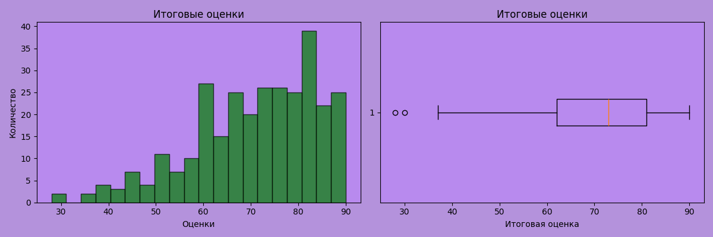

### 3.3. Стандартное отклонение оценок

Большинство треков имеют низкое стандартное отклонение (<1.0), что говорит о высокой согласованности мнений.

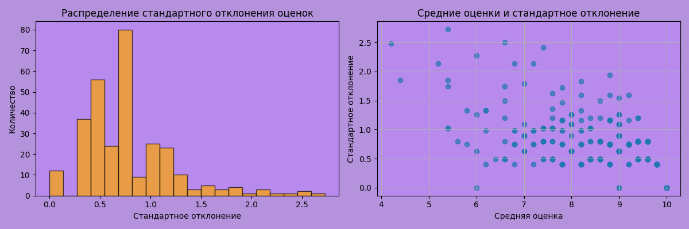

---

## 4. Рынок музыкальных стриминговых сервисов (2020–2025)

Этот раздел предоставляет контекст для проекта, показывая, какие платформы доминируют на рынке и на какую аудиторию ориентируется модель.

### 4.1. Рост аудитории стриминговых сервисов (2020–2024)

График показывает динамику роста активных пользователей основных платформ за последние 5 лет.

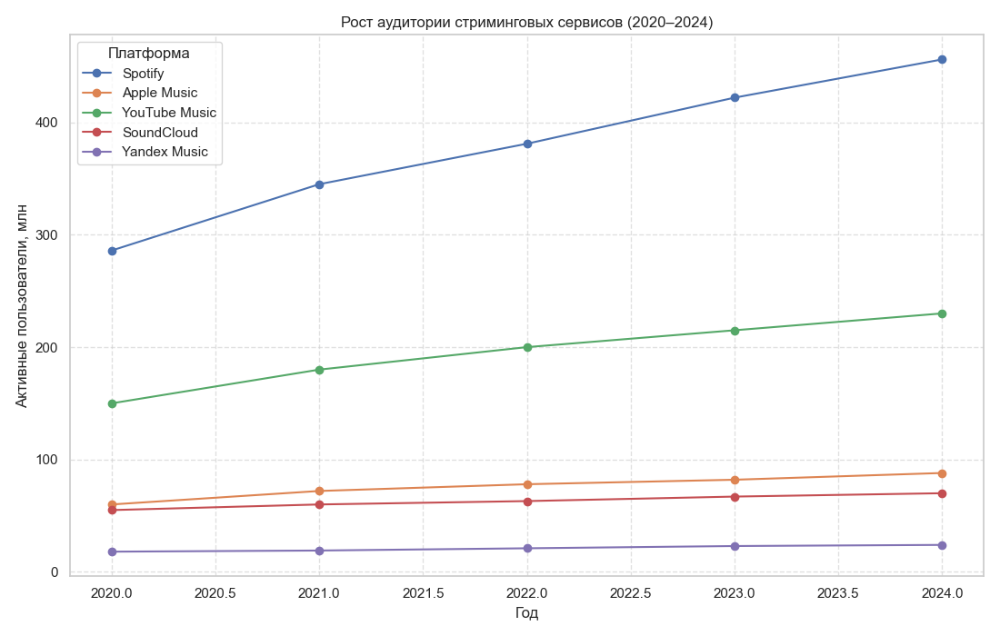

**Выводы:**
- **Spotify** лидирует с огромным отрывом и продолжает расти.
- **YouTube Music** демонстрирует устойчивый рост, но значительно отстаёт от Spotify.
- **Apple Music** и **SoundCloud** растут медленнее, но стабильно.
- **Yandex Music** имеет небольшую, но стабильную базу пользователей.

### 4.2. Количество пользователей музыкальных стримингов (млн, 2024–2025)

Горизонтальная столбчатая диаграмма сравнивает размер аудитории на конец 2024 года.

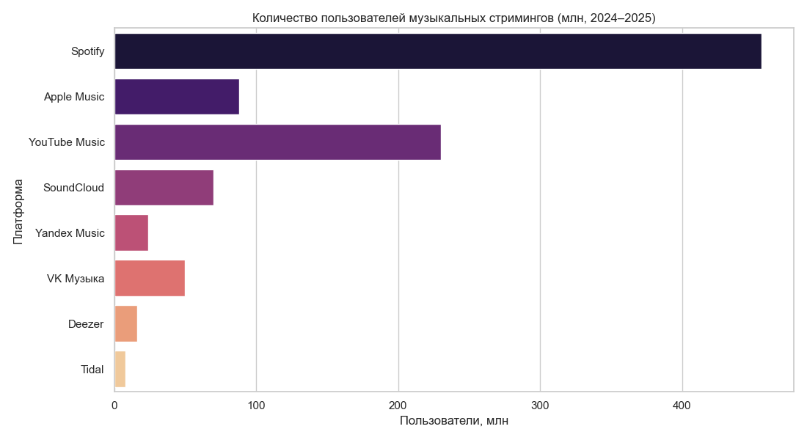

**Выводы:**
- **Spotify** — абсолютный лидер (~450 млн).
- **YouTube Music** — второй по величине (~230 млн).
- **Apple Music** — третий (~85 млн).
- Остальные платформы (SoundCloud, VK Музыка, Deezer, Tidal) имеют значительно меньшую долю.

### 4.3. Доли стриминговых платформ в общей аудитории

Круговая диаграмма показывает долю каждой платформы в общем количестве пользователей.

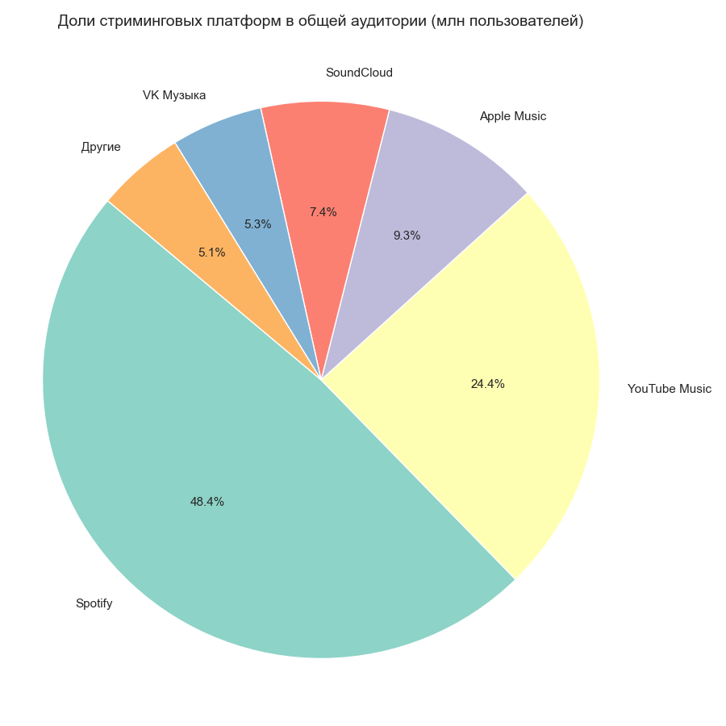

**Доли:**
- **Spotify**: **48.4%**
- **YouTube Music**: **24.4%**
- **Apple Music**: **9.3%**
- **SoundCloud**: **7.4%**
- **VK Музыка**: **5.3%**
- **Другие**: **5.1%**

**Вывод:** Рынок крайне концентрирован. Более половины пользователей приходится на Spotify и YouTube Music. Это означает, что модель должна быть особенно точной для треков, популярных на этих платформах.